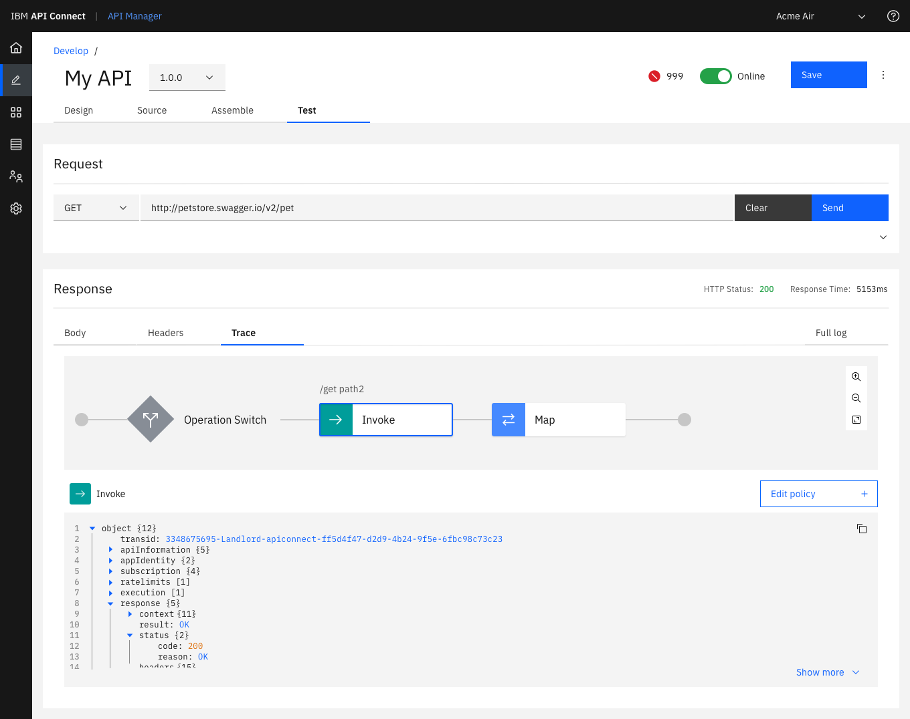

Please note that the new version of API Connect **V10** is released !

The main new features are:
  - Administration
    - Used of **operators** to deploy APIC cluster on k8s. It really easy the deployment !
  - Security
    - GraphQL support: APIC allows new to protect your GraphQL backend.
    - Gateway support for Kafka and AMQP as client (proxy is expected in the future)
  - Development
    - Ability to trace API calls within the API test tool
    - A new more responsive UI
  - Monitoring
    - A new component is now available with API Connect to test and monitor your APIs. The new component is based on the solution [Test & Monitor](https://ibm-apiconnect.github.io/test-and-monitor/) available for **free** on the cloud.

** Development
The trace utility available on the API developer tool help understanding the behaviour of the assembly:

[Knowledge Center](https://www.ibm.com/support/knowledgecenter/SSMNED_v10/com.ibm.apic.overview.doc/api_management_overview.html)