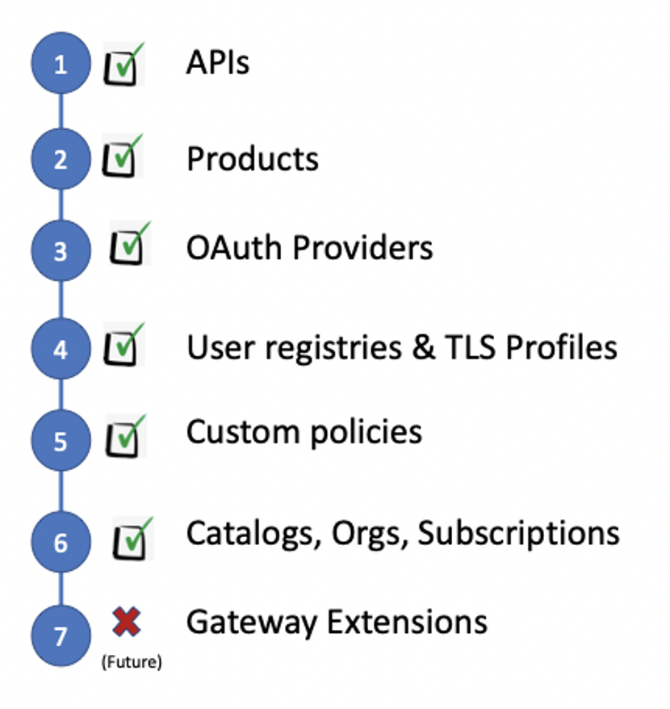

A migration tool is provided to help customer to migrate their APIC V5 installation to V10.

The tool is called `AMU` for API Connect Migration Utility.
You can find information on this tool in the [knowledge center](https://www.ibm.com/support/knowledgecenter/SSMNED_v10/com.ibm.apic.install.doc/migrating.html).

It provides the following support migration capabilities:

In a nutshell all your configurations would be migrated except the Gateway extensions that would require manual interventions.

A run book is available at the following link: https://community.ibm.com/community/user/imwuc/viewdocument/api-connect-migration-utility-amu?CommunityKey=2106cca0-a9f9-45c6-9b28-01a28f4ce947&tab=librarydocuments
