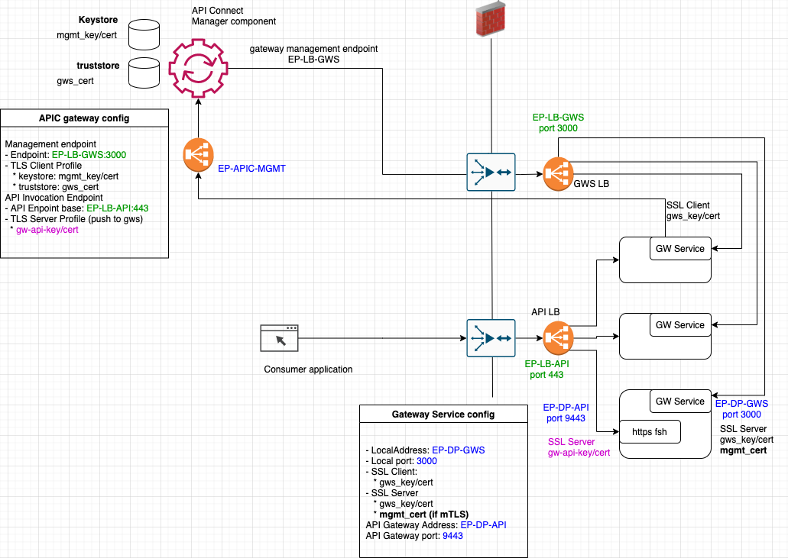

This post provides information on the settings defined on the API Gateway Service configured on the API Gateway (DataPower).
It provides as well an overview on the interaction between the API Connect manager and the API Gateway (DataPower).

# Configuration 

The new API Gateway (DataPower) is using a new service called the **API Gateway Service** (GWS).
This service is receiving configuration from API Connect manager and is also calling API Connect manager.
All the API definition set on API Connect are provided through this channel.
The https front side handler user to serve API traffic is also configured by the GWS. The TLS configuration of the handler is made using information provided in the manager cloud interface.

The API Gateway are located behind load balancers:
- GWS LB: load balancer for the API Gateway Service
- API LB: load balancer for the API traffic.
 
## Manager
On the manager side, the following information are configured:
- Management endpoint
  - Endpoint. This is the endpoint that the manager will used to reach the gateway. The LB is therefore here set: EP-LB-GWS:3000
  - TLS Client Profile. This object is configured in the management cloud interface under resource->TLS. The TLS client may use of a keystore and trustore.
    * keystore: mgmt_key/cert (those are the management key and certificate)
    * truststore: gws_cert (this is the certificate that the gateway service is using to connect. It is required if mTLS is configured)
- API Invocation Endpoint
  - API Enpoint base. This is the hostname:port that will be referenced in the developer portal and that is used by the consumer application. This is the load balancer endpoint (if no LB is conigured it will be the DataPower IP). 
    - EP-LB-API:443
  - TLS Server Profile: this will be used to configure the TLS Server on the front side handler (https listener on the DataPower). The key and certificate that will be exposed on the gateway is uploaded in the TLS object.
    - gw-api-key/cert
  
## Gateway

- LocalAddress: This is the IP address used by the gateway service to receive network traffic from the management interface. It is the IP address of the local DataPower network inteface. 
    - EP-DP-GWS
- Local port: this is the port of the local DataPower network interface.
    - 3000
- SSL Client: this is the configuration used by the gateway service to call the API manager.
   * gws_key/cert
- SSL Server: this is the TLS configuration used to establish a TLS communication when the manager connects to the DataPower on the IP defined at localAddress. Key and certificate needs to be provided. If mTLS is configured, the API Connect manager certificate need to be uploaded and configured using the val credentials DataPower object.
   * gws_key/cert
   * mgmt_cert (if mTLS)
- API Gateway Address: this is the IP address that is used by the https listener to receive API call on the DataPower. It should be an available IP address of the local network interface. 
  - EP-DP-API
- API Gateway port: this is the port used to recive incoming API traffic on the local network interface configured at API Gateway Address. 
  - 9443

Note that host alias name can be used to define the network address.

If the gateway service is not up this might be due to
- wrong gateway peering configuration
- wrong IP address: all address configured on the DataPower side should be local available address that has been configured on the DataPower default domain
- port in use: the port configured here are ports that will be created on the configured local address (local network card). Ensure that these ports are not used by other services. Port in use can be found by searching for "TCP port Status"
- If ports have been used by other services, it might be required to restart the domain (from default domain, search "application domain" -> click domain > restart).
- Configuration sequence object has not been configured or does not have the right access to configure the DataPower domain objects.