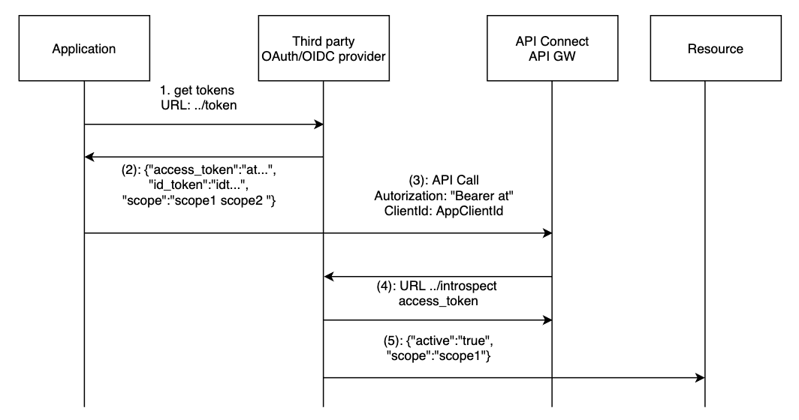

The aim of this post is to explain how to configure an third party OAuth provider with API Connect (v10).  
I also provide how you could create a proxy to play the role of the introspect URL on the behalf of the OAuth server. In this approach you could validate JWT token using JWK.   
For simplicity the principle is illustrated using a OAuth resource owner password grant.

The sections provided in this topic are:
- how OpenId is supported
- how the API Connect security principle
- how the OAuth objects are configured
- example test with IBM cloud AppId provider
   - The example provided here is made with an OAuth resource owner password grant.
   - The test example made at the end has been done using IBM App ID as external OAuth provider [AppId getting started](https://cloud.ibm.com/docs/appid?topic=appid-getting-started).

The last section provides references to resources.

If you are looking to get more insight on different way to protect your API with OAuth with API Connect as the OAuth provider please look at this very good lab [Manage your API with API Connect](https://github.com/ADesprets/bluemix-labs/blob/master/Lab%20API%20-%20Manage%20your%20APIs%20with%20API%20Connect/README-V10.md#table-of-content).

## OpenId support

As described in [openid.net](https://openid.net/connect/) OpenId is a simple identity layer on top of the OAuth 2.0 protocol.   
When an application (f.e. web or mobile application) requests a token to an OIDC provider, it receives additionally to the access token an id token (id_token). The id token contains information about the user that is accessing the resource.  

The access token is used by the application to get access to the resource through the API exposed by the gateway.

The application can use the access token as security credentials (Bearer) to get additional information about the user by calling the "userinfo" URL of the OIDC provider.

If you configure API Connect to use an external OIDC provider, the application should get the access token from the external OIDC provider and use the access token to call the API exposed by the Gateway.
The processing of the access token is the same as it would have been a normal OAuth2 provider.

## OAuth security principle

This section provides an overview on how API Connect behaves when an external OAuth provider is configured.

When an external OAuth provider is configured, API Connect will delegates the token generation and validation to the third party OAuth provider. 

In API Connect, the different external OAuth providers are defined under the OAuth resource section.

The following diagram depicts the flow that happens when using an OAuth resource owner password grant (with oidc)



The flow is as follow:  
* (1) The application request an access token using the "../token" provider URL and an id token (for OIDC by setting the scope "openid").
* (2) The Third party provides back the "access token", the "scopes" that are authorized with this access token and an "id token" if the OAuth provider support OIDC and the scope "openid" has been requested.  
* (3) The application uses the "access token" to get access to the API exposed by the API Gateway  
* (4) The API Gateway calls the third party OAuth provider with the "../introspection" URL.  
* (5) The Oauth provider sends back a response telling if the token is valid or not along with supported scopes. The response looks like  
`{"active":"true","scope":"scope1 scope2"}`  
The API GW will check that the active field is to "true" and will verify that the returned scopes match the one defined on the security definition of the exposed API. If it doesn't match the call is rejected.  
It is possible to further validate the scopes or even adapt the scopes by configuring a scope validation step.  
The introspection URL might be protected and it is possible to provide credentials to gain access to this URL. Credentials can be configured directly on the API Connect OAuth resource or it can be provided by the API call through an Authorization header.     
* (6) the request is allowed to reach the resource.


Example of introspect request:
```s
POST /oauth/introspectURL HTTP/1.1
     Host: apiconnect.ibm.com
     Content-Type: application/x-www-form-urlencoded
     x-Introspect-type: customHeader
     x-custom-myHeader: myValue
     token=xxx&token_type_hint=access_token&client_id=inputAppClientId&scope=apiprotectedscope"
```

Additional information about parameters provided in the request is provided on the example section. Complete details information about the introspection can be found in the knowledge center at [introspection](https://www.ibm.com/support/knowledgecenter/SSMNED_v10/com.ibm.apic.apionprem.doc/oauth_introspection.html).   

Note that API Connect can also play the role of an OAuth or OIDC provider.

It is good practice to secure your API not only with an access token but with a client id as well. There are multiple reason for this:  
- The third party provider would like to validate that the client id used by the application matches the one defined in the access token (API Connect sends as part of the introspect request the client id if it was provided).
- This is also a requirement if you would like to be able to get analytics insight of your application.   

It is therefore necessarily to synchronize the client id and secret between API Connect and the external OAuth provider.
In this post the approach is to use the OAuth provider application credentials and override (or create) the application credentials within API Connect.

## API Connect Setup

The steps provided to create the different resources are high level only.
Detailed information can be found in the knowledge center at [Implementing OAuth security](https://www.ibm.com/support/knowledgecenter/en/SSMNED_v10/com.ibm.apic.apionprem.doc/tutorial_apionprem_oauth_passgrant.html).  
Another very good article that describes how to secure an API in API Connect can be found here at the section [using OAuth to protect your API](https://github.com/ADesprets/bluemix-labs/blob/master/Lab%20API%20-%20Manage%20your%20APIs%20with%20API%20Connect/README-V10.md#step-12---using-oauth-to-protect-your-api).


This post focus more on understanding the principle and the usage of the different parameters. 

I provided example on how to create the objects using [API Connect toolkit cli](https://www.ibm.com/support/knowledgecenter/en/SSMNED_v10/com.ibm.apic.toolkit.doc/tapim_cli_install.html).
> Before been able to use the toolkit, you need to login.
I posted an article on how to use the cli if you need additional help.

### Setup Overview

The following tasks have to be made on API Connect in order to use OAuth:   
- Create a third-party OAuth provider resource
- Add the resource to the catalog where the API Project will be deployed
- Set the API Security definition in your API definition

The OAuth resource is usually configured by an organization administrator. 
The OAuth resource defines
- the type of OAuth grant flow to be supported
- the required URLs with the credentials to access the third-party provider 
- the allowed scopes that can be used when securing an API.  

The OAuth provider resource needs to be configured on the catalog where the API product will be deployed. 

The following tasks is made on the API definition to secure it with the configured OAuth resource:  
- Add a security definition
  - select the OAuth provider resource. This will provides all the predefined configuration.
  - select the possible OAuth flow grant that is supported and that has been configured on the OAuth resource
  - select the scope(s) that you would like to use to protect your API operations.   
  The allowed scopes are only those that have been configured on the OAuth resource. Adding an undefined scope will prevent the flow to be deployed. This prevent a developer to choose an unsupported scope for the API.   
  It is possible to select a subset of scopes (delete the scopes that you don't want to use).
- You can apply this security definition on all operations by adding it to the API security configuration or you can override it at the operation level.  
When overriding the security at the operation level it is possible to select a subset of scopes. When multiple scopes are selected for an operation, all the scopes need to be returned during the access token introspection.

**Note**: 
- The external OAuth provider needs to return scopes in order for the API GW to enforce the scopes defined to secure the API. 
- If the external OAuth provider doesn't provide the required scopes or introspect URL, it is always possible to develop an introspection API proxy in API Connect that would set the required properties and data.
- The Token Management Service on the API Gateway needs to be configured to support OAuth.

### OAuth resource
The first thing that needs to be done is the creation of the OAuth provider resource in API Connect.  

Before starting this setup you need the following information
    - External OAuth provider URLs
    - Client Id & secret credentials to call the external OAuth provider (If the external OAuth provider introspect URL is protected)
    - Scopes that you would like to allow for API Security definitions.

Create a OAuth provider resource by logging in in the provider organization
    - Org -> resource -> OAuth provider

The OAuth provider can be created using the command and with the APIConnect toolkit:

```shell
export apicmgmt=mgmt-api-manager-apic.ibm.cloud
./apic oauth-providers:create -s $apicmgmt -o <providerOrg> --format json thirdpartyoidc.json
```  

A "thirdpartyoidc" yaml is provided here after:  


<details>

```json
{
    "type": "oauth_provider",
    "api_version": "2.0.0",
    "name": "appidoidc",
    "title": "AppIdThirdPartyOIDC",
    "debug": false,
    "provider_type": "third_party",
    "scopes": {
        "audit": "Sample scope description 1",
        "openid": "to enable OIDC"
    },
    "grants": [
        "password",
        "jwt"
    ],
    "gateway_version": "6000",
    "advanced_scope": {
        "override_endpoint_from_api": false
    },
    "third_party_config": {
        "token_validation_requirement": "active",
        "introspection_endpoint": {
            "endpoint": "https://eu-de.appid.cloud.ibm.com/oauth/v4/<tenantId>/introspect"
        },
        "authorize_endpoint": "https://eu-de.appid.cloud.ibm.com/oauth/v4/<tenantId>/authorize",
        "token_endpoint": "https://eu-de.appid.cloud.ibm.com/oauth/v4/<tenantId>/token",
        "security": [
            "basic-auth"
        ],
        "basic_auth": {
            "request_headername": "x-introspect-basic-authorization-header",
            "username": "xxxx",
            "password": "xxxx"
        },
        "introspect_cache_type": "no-cache",
        "advanced_scope_security": {
            "enabled": false,
            "mode": [
                "basic-auth"
            ],
            "basic_auth": {
                "request_headername": "x-advanced-scope-basic-authorization-header"
            }
        }
    }
}
```
</details>

Some **notes**:  
- The debug option doesn't work with third party provider.
- scopes: here are the scope that you would allow developer to use. Developer can use a subset but those defined at the API definition level by the developer needs to be listed here (API Connect will prevent to deploy the API definition).
- Advanced scope allows to call a service that could refine or change the scopes been set by the introspection URL.
- Token validation: the introspect response payload should have the field "active=true".

> If it is not possible to integrate directly with the third party provider, it is always possible to create an API Definition that would act as a proxy. This approach as the advantage that you would have more control and visibility on how to access the third party provider. However this would be an extra API call.

As we are using https for the introspection, a TLS profile need to be defined.  
You would need to configure this using the UI. It should be possible to do this through the command line by getting the default TLS profile ID and setting it to the definition.

### Catalog setup

In order to be able to deploy the API product with a OAuth provider configured, the referenced OAuth provider needs to be configured at the catalog level.

Organization --> Manage --> Catalog --> Settings --> OAuth provider

> Note that the embedded tookit in API Connect manager browser is deploying the API on the sandbox. Hence the OAuth provider needs to be configure on the **sandbox** catalog.

### API Security definition

The security definition is defined in the API definition.   
The developer tasks are:  
- open the API Security definition tab
- add a new security definition
- provides a meaningful name
- select the configured OAuth provider, OAuth flow
- select the scopes that he would like to use. The other scopes can be deleted. 

It is possible to configure that the OAuth security is applied on all API operation by selecting it under the API Security tab.   
It is possible to configure the OAuth security for a specific operation by overriding the security definition at the API level.


An example of an API Definition is provided here and in the 
[file](../assets/files/oauth-api-loopback.yaml){:target="_blank"}     
   

<details>
  <summary>api using OAuth</summary>   


```yaml
swagger: '2.0'
info:
  title: loopback
  x-ibm-name: loopback
  version: 1.0.0
schemes:
  - https
basePath: /loopback
securityDefinitions:
  extoauth:
    type: oauth2
    flow: password
    x-ibm-oauth-provider: thirdpartyoidc
    tokenUrl: >-
      https://eu-de.appid.cloud.ibm.com/oauth/v4/8794b41b-4705-4381-a96e-46dfabf3f249/token
    scopes:
      audit: audit scope to access API
      execute: scope to access API with scope execute
  clientID:
    type: apiKey
    in: header
    name: X-IBM-Client-Id
security:
  - clientID: []
x-ibm-configuration:
  cors:
    enabled: true
  gateway: datapower-api-gateway
  type: rest
  phase: realized
  enforced: true
  testable: true
  assembly:
    execute:
      - gatewayscript:
          version: 2.0.0
          title: gatewayscript
          source: |-
            var response = {"echo":"success"};
            context.message.body.write(JSON.stringify(response));
  application-authentication:
    certificate: false
paths:
  /echo:
    get:
      responses:
        '200':
          description: success
          schema:
            type: string
      consumes: []
      produces: []
      security:
        - extoauth:
            - audit
          clientID: []
  /execute:
    get:
      responses:
        '200':
          description: success
          schema:
            type: object
      security:
        - clientID: []
          extoauth:
            - execute
      consumes: []
      produces: []

```
</details>


The API has the following configuration:
- An API security that defines that a Client Id is required by default (can be overridden)
- An API security definition that defines OAuth
  - It defines two scopes (audit and execute)
- Two operations where the API Security has been overridden
  - operation **echo**: protected by OAuth and the scope audit
  - operation **execute**: protected by OAuth and the scope execute


### Application credentials

When a new app is created in the external OAuth provider, the credentials client_id and secret needs to be synchronized with API Connect.
Credentials can be updated on any existing API Connect application.

Example of API Connect application configuration file:

```yaml
{
	"type": "app",
	"api_version": "2.0.0",
        "name": "appid-demoapp",
	"title": "AppId Credentials for MyMobileApp",
	"summary": "AppId Credentials for MyMobileApp",
	"client_id": "AppIdClientId",
	"client_secret": "AppIdSecret"
}
```

Command to create the application:
```shell
./apic apps:create -s $apicmgmt -c <catalog> --consumer-org <developer-org> -o <provider-org> appid-demoapp.json --format json
```
Credentials can be verified using the following command:
```shell
./apic credentials:list --format json --consumer-org <developer-org> -c <catalog> -o <provider-org> -a appid-demoapp -s $apicmgmt
```

To list the consumer organisations (which are the developer organisation in the developer portal):
```shell
./apiccli consumer-orgs:list -c sandbox -s $apicmgmt -o innovative-org
```

     
    
## Test the configuration

Before been able to access the API you need to subscribe your application to the published API in the developer portal (note that this can also be automated using cli or rest api).

Get the required access token from AppId.

To access your protected API, you need to get an access token from the external OAuth provider.

Example of Curl command:
```shell
curl -X POST -u "<cliendId:cliendSecret>" -d "grant_type=password&username=<userId>&password=<UserPassword>" https://eu-de.appid.cloud.ibm.com/oauth/v4/8794b41b-4705-4381-a96e-46dfabf3f249/token
```

If you just need the access token you can use jq to parse the response: 
```shell
curl -X POST -u .... | jq -r '.access_token'
```


On this example, the user <userId> is trying to get access to the API with the application identified by <clientId>.
In order to be able to access the API, the required scopes need to be available for this combination or user - application.
In AppId, the scopes returned are provided by the roles assigned to the user.

Response example:
```json
{
    "access_token":"eyJhbGciOiJSUzI1NiIsInR5cCI6IkpXVCIsImtpZCI6ImFwcElkLTg3OTRiNDFiLTQ3MDUtNDM4MS1hOTZlLTQ2ZGZhYmYzZjI0OS0yMDIxLTAxLTExVDEzOjQ3OjQ3LjU1NiIsInZlciI6NH0.eyJpc3MiOiJodHRwczovL2V1LWRlLmFwcGlkLmNsb3VkLmlibS5jb20vb2F1dGgvdjQvODc5NGI0MWItNDcwNS00MzgxLWE5NmUtNDZkZmFiZjNmMjQ5IiwiZXhwIjoxNjExNTcxMDQ1LCJhdWQiOlsiZDEyZTMzNzUtZmVlMS00YjM1LTk1Y2QtZGYwM2VlMjAxM2Q2Il0sInN1YiI6ImM5OTE3OThlLTI0MDItNDI5MS04NDAwLWUxMzg3N2NiYmJiNiIsImVtYWlsX3ZlcmlmaWVkIjp0cnVlLCJhbXIiOlsiY2xvdWRfZGlyZWN0b3J5Il0sImlhdCI6MTYxMTU2NzQ0NSwidGVuYW50IjoiODc5NGI0MWItNDcwNS00MzgxLWE5NmUtNDZkZmFiZjNmMjQ5Iiwic2NvcGUiOiJvcGVuaWQgYXBwaWRfZGVmYXVsdCBhcHBpZF9yZWFkdXNlcmF0dHIgYXBwaWRfcmVhZHByb2ZpbGUgYXBwaWRfd3JpdGV1c2VyYXR0ciBhcHBpZF9hdXRoZW50aWNhdGVkIGV4ZWN1dGUgcGF5bWVudHMifQ.FINpWrp9uNEXmAaIhNITA3tpHRgkqgOHphXv9mt3tkNQ2w9VUl0dbx8shOf4CYFrBhF9w22u9DnfSeqCPcppKaWW7yqJsJ_kESrPmc9PvPVoY0_2dX27Y50_wFUrSS07Fd0zXplG-4l47A_tpfGx7lWwnIOZaHe-4du05VU9YleTlvw49QQwlikFUVwGRJOA_Hv7miCVkNkpw3R_mr75FeGymkM6E62yAf09RKWWyYX4CCL_QrmbWv0ndVhAfT4GoSOzpmmMqFIPBdjSBwbwSD9IxRnh7eYEfX1oYWMrS-C2pExlzt5XFE1-nckVDwCB4Y2VH3OXY3ZvbYVmNoZNaQ",
    "id_token":"eyJhbGciOiJSUzI1NiIsInR5cCI6IkpXVCIsImtpZCI6ImFwcElkLTg3OTRiNDFiLTQ3MDUtNDM4MS1hOTZlLTQ2ZGZhYmYzZjI0OS0yMDIxLTAxLTExVDEzOjQ3OjQ3LjU1NiIsInZlciI6NH0.eyJpc3MiOiJodHRwczovL2V1LWRlLmFwcGlkLmNsb3VkLmlibS5jb20vb2F1dGgvdjQvODc5NGI0MWItNDcwNS00MzgxLWE5NmUtNDZkZmFiZjNmMjQ5IiwiYXVkIjpbImQxMmUzMzc1LWZlZTEtNGIzNS05NWNkLWRmMDNlZTIwMTNkNiJdLCJleHAiOjE2MTE1NzEwNDUsInRlbmFudCI6Ijg3OTRiNDFiLTQ3MDUtNDM4MS1hOTZlLTQ2ZGZhYmYzZjI0OSIsImlhdCI6MTYxMTU2NzQ0NSwiZW1haWwiOiJvbGl2ZXIuZ3JlZW5AaWJtZGVtby5jb20iLCJuYW1lIjoiT2xpdmVyIEdyZWVuIiwic3ViIjoiYzk5MTc5OGUtMjQwMi00MjkxLTg0MDAtZTEzODc3Y2JiYmI2IiwiZW1haWxfdmVyaWZpZWQiOnRydWUsImdpdmVuX25hbWUiOiJPbGl2ZXIiLCJmYW1pbHlfbmFtZSI6IkdyZWVuIiwiaWRlbnRpdGllcyI6W3sicHJvdmlkZXIiOiJjbG91ZF9kaXJlY3RvcnkiLCJpZCI6IjBhZjZjZGM0LTZlYmQtNGU3NC04ZjNiLWIxNDBlZjEyMjFkMiJ9XSwiYW1yIjpbImNsb3VkX2RpcmVjdG9yeSJdfQ.g2gHJcsT7i4d8fO8aXRzXxHdnVmDhQcLvzuPiIRcLq8J6vhvTlMaxcCPYyl2pb4hPvieiRzgwy3qyshFf8TD2yz5hmF2H8Tp2pqlQ-ikZ3Pa-aJmch6hS5ZTOHRrFW1T4IcAyBOkDGUuHFA-YMquourQ2UhkaC27HKyyQWaZ2QKwCnXeyAI9CnSvitg5f8aDm-pXLfpRP8BijnpY05nPwKGeE9IKJoMQXGaGKXhdq4NyYygDLbXCZsACWuJLxVlHokv3-b6ApBjf21d8TOg_x_t0at81UASzb4iPGErAqqGmlv6QeJyH-NG8EXl0-cYrJcemOWYHmKjTogMhtmFIbg",
    "token_type":"Bearer",
    "expires_in":3600,
    "scope":"openid appid_default appid_readuserattr appid_readprofile appid_writeuserattr appid_authenticated execute payments"}
```

The response contains
- the access token that should be used to access the API protected by API Connect
- the id token that contains information about the user
- the scopes. 

For the curious here is the content (it would depends of the OAuth provider) of  
**the access token**
```json
{
  "iss": "https://eu-de.appid.cloud.ibm.com/oauth/v4/8794b41b-4705-4381-a96e-46dfabf3f249",
  "exp": 1611240617,
  "aud": [
    "<ClienId>"
  ],
  "sub": "<UserId>",
  "email_verified": true,
  "amr": [
    "cloud_directory"
  ],
  "iat": 1611237017,
  "tenant": "<tenantId>",
  "scope": "openid appid_default appid_readuserattr appid_readprofile appid_writeuserattr appid_authenticated execute payments"
}
```

The claims within the JWT token are:   
- aud: is for whom the access token has been delivered. The access token is to be used by the client application
- sub: is the user that has been used to get the access token. The user that grants the access to the resource.
- scope: all the scopes that are allowed for this specific user. In AppId the scopes are provided by the role assigned to the user. **execute** scope is listed in the possible scope for this access token.

<details>
<summary> Example of id token</summary>

```json
{
  "iss": "https://eu-de.appid.cloud.ibm.com/oauth/v4/8794b41b-4705-4381-a96e-46dfabf3f249",
  "aud": [
    "<ClientId>"
  ],
  "exp": 1611571045,
  "tenant": "<tenantId>",
  "iat": 1611567445,
  "email": "oliver.green@ibmdemo.com",
  "name": "Oliver Green",
  "sub": "<UserId>",
  "email_verified": true,
  "given_name": "Oliver",
  "family_name": "Green",
  "identities": [
    {
      "provider": "cloud_directory",
      "id": "id"
    }
  ],
  "amr": [
    "cloud_directory"
  ]
}
```
</details>

**Note**: AppId doesn't support CORS. Which means that it is not possible to get an access token from the developer portal. The access token should be get directly from the OAuth provider (AppId).


It is now possible to call the protected API:

```shell
curl -X POST -H "Authorization: Bearer <access_token>" -H "accept: application/json" -H "X-IBM-Client-Id: <cliendId>" https://<api-gw>/<provider-org>/<catalog>/loopback/execute
{"echo":"success"}
```

## Implement an introspect API
This section explains how an introspect API can be build within API Connect.   
Sometimes the OAuth provider doesn't provide an introspect URL or doesn't provide all the token validation/revocation policies.  
In that case, using an API Connect API as proxy provides a lot flexibility because all the required security policies can be implemented in such API definition.

Another use case is when the access token is a JWT token and you would like to validate on the gateway the signature of the token as well as the claims.  
The OAuth 2.0 specification defines how external keys can be fetch from an OAuth 2.0 authorization server. The server can expose [metadata](https://tools.ietf.org/html/rfc8414) which may provide the jwks uri: the referenced document contains the signing key(s) the client uses to validate signatures from the authorization server.

The API function is to validate the access token and return to the gateway a response back that tells if the token is still active and if it is the case for what scopes.

The payload returned should be in the form:  

```json
   HTTP/1.1 200 OK
    Content-Type: application/json;charset=UTF-8
    Cache-Control: no-store
    Pragma: no-cache

    {
      "active":true,
       "token_type":"bearer",
       "client_id":"xxx-xxx",
       "scope":"scope1 scope2",
       ...
    }
```

The example provided here performs the following:
- Extract the access token from the introspect call
- call the authorization server to fetch the JWK keys that will be used to validate the JWT signature
- validate the JWT signature
- create the response to the gateway using the JWT claims

If the JWT signature fails, an error is sent back to the gateway that will reject the access.

The file is available in my [github OAuth section](https://github.com/prichelle/apic-v10-tutorials/blob/main/oauth/oauth-api-introspect-proxy.yaml) as well.
<details>
<summary>Introspect API</summary>

```yaml
swagger: '2.0'
info:
  title: OAuth-TP
  x-ibm-name: oauth-tp
  version: 1.0.0
schemes:
  - https
basePath: /oauth-tp
produces:
  - application/json
consumes: []
security:
  - {}
securityDefinitions:
  clientID:
    type: apiKey
    in: header
    name: X-IBM-Client-Id
x-ibm-configuration:
  cors:
    enabled: true
  gateway: datapower-api-gateway
  type: rest
  phase: realized
  enforced: true
  testable: true
  assembly:
    execute:
      - gatewayscript:
          version: 2.0.0
          title: gatewayscript
          source: >
            context.request.body.readAsBuffer(function(error, buffer) {
              if (error) {
                context.message.statusCode = '500';
              }
              if(buffer) {
                var response = {"active" : true};

                var bodyStr = buffer.toString();
                var bodyParsed = bodyStr.split('&');

                for (var i = 0; i < bodyParsed.length; i++) {
                    var pair = bodyParsed[i].split('=');
                    console.debug('pair: ' + pair[0]);
                    if (pair[0]==='token'){
                        response['reqat'] = pair[1];
                        context.set('reqat',pair[1]);
                        console.debug('token: ' + pair[1]);
                    }
                 }
              }
              else{
                  context.message.statusCode = '500';
                  }
            });
      - invoke:
          title: invoke
          timeout: 60
          verb: GET
          cache-response: protocol
          cache-ttl: 900
          version: 2.0.0
          target-url: 'https://authorizationServer/keys'
          output: rsa256-key
          header-control:
            type: blacklist
            values: []
          parameter-control:
            type: blacklist
            values: []
          tls-profile: 'tls-client-profile-catalog-default:1.0.0'
          backend-type: json
      - gatewayscript:
          title: gatewayscript
          version: 2.0.0
          source: |-
            var rsa256Key = JSON.parse(context.get('rsa256-key.body'));
            console.error('rsa keys %s', rsa256Key.keys[0]);
            context.set('jwk-key', rsa256Key.keys[0]);
      - jwt-validate:
          version: 2.0.0
          title: at-jwt-validate
          jwt: reqat
          output-claims: decoded.claims
          jws-jwk: jwk-key
          description: test
      - gatewayscript:
          title: gatewayscript
          version: 2.0.0
          source:  >
            if (context.get('decoded.claims')) {
              var response = { "active": true };
              
              var decClaims = context.get('decoded.claims');
              response.scope = decClaims.scp; //claims scp contains the scopes
              
              context.set('message.body', response);
              
              context.message.header.set('content-type','application/json');
              context.message.header.remove('authorization');

              context.set('message.status.code', 200);

              console.debug ('>> oauth introspection is successful %s');
            }
            else {
              var response = { "active": false }; //no scope are available
              context.set('message.body', response);
              
              context.message.header.set('Content-Type','application/json; charset=utf-8');
              context.message.header.remove('authorization');
              
              context.set('message.status.code', 200);

              console.debug ('>> oauth introspection failed due to missing scope ');
            }
    catch: []
  application-authentication:
    certificate: false
  activity-log:
    success-content: payload
    error-content: activity
    enabled: true
  buffering: true
paths:
  /introspect:
    post:
      responses:
        '200':
          description: success
          schema:
            type: string
      parameters: []
      consumes: []
      produces: []
      security: []

```

</details>


## AppId configuration

This section shows what need to be configured in IBM AppId.

### Application
Create an application of type "regularwebapp".
The information that will be available afterwards are provided here:

```json
{
  "clientId": "xxxx",
  "tenantId": "8794b41b-4705-4381-a96e-46dfabf3f249",
  "secret": "xxxx",
  "name": "apiconnect-app",
  "oAuthServerUrl": "https://eu-de.appid.cloud.ibm.com/oauth/v4/8794b41b-4705-4381-a96e-46dfabf3f249",
  "profilesUrl": "https://eu-de.appid.cloud.ibm.com",
  "discoveryEndpoint": "https://eu-de.appid.cloud.ibm.com/oauth/v4/8794b41b-4705-4381-a96e-46dfabf3f249/.well-known/openid-configuration",
  "type": "regularwebapp",
  "scopes": []
}
```
Information to note:
- client Id
- secret
- tenant Id

### Role
A user needs to have a role.
The role is used to assign scopes to a specified user.  
-> Manage Authentication -> Profiles & Roles -> Roles  
Create a Role with the required scopes
```json
{
  "id": "xxxx",
  "description": "",
  "name": "validator",
  "access": [
    {
      "scopes": [
        "execute"
      ],
      "application_id": "xxxx"
    }
  ]
}
```
The information to note:
- Scopes
- name

### User
-> Manage Authentication -> Cloud Directory --> Users  
Create a user using Cloud directory and assign to the user the required role.  
When requesting an access token with the user, the scopes returned would be those related to the scope.

User
```json
{
  "identities": [
    {
      "provider": "cloud_directory",
      "id": "xxxx",
      "idpUserInfo": {
        "displayName": "Oliver Green",
        "active": true,
        "mfaContext": {},
        "emails": [
          {
            "value": "oliver.green@ibmdemo.com",
            "primary": true
          }
        ],
        "name": {
          "givenName": "Oliver",
          "familyName": "Green",
          "formatted": "Oliver Green"
        },
        "id": "xxxx",
        "status": "CONFIRMED"
      }
    }
  ],
  "sub": "xxxx",
  "attributes": {}
}
```

Information to note:
- The **User id** that will be used by the request = **email addreess** 
- The user **password**

The link to the role is defined in the user profile.
-> Manage Authentication -> User profiles 

### Service credentials
Create a service credential which will provide the token url endpoint.

Information to note:
- "oauthServerUrl": "https://eu-de.appid.cloud.ibm.com/oauth/v4/8794b41b-4705-4381-a96e-46dfabf3f249"

URL will be build as
- Token endpoint will be oauthServerUrl/token
- Introspect endpoint will be oauthServerUrl/introspect


## Resources  

[AppId getting started](https://cloud.ibm.com/docs/appid?topic=appid-getting-started).

[Auth0 resource owner password](https://auth0.com/docs/flows/call-your-api-using-resource-owner-password-flow)

[Manage your API with API Connect](https://github.com/ADesprets/bluemix-labs/blob/master/Lab%20API%20-%20Manage%20your%20APIs%20with%20API%20Connect/README-V10.md#table-of-content).