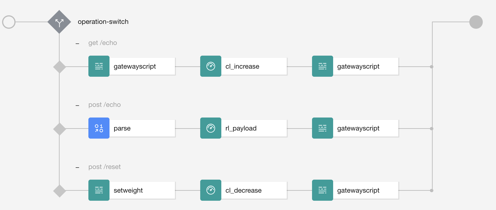

# Introduction

In this topic I will introduce the new assembly rate limit that has been introduced for GraphQL.  
Even though it's primary usage is to be used in a GraphQL API it can also be used in a standard standard openAPI.  

An example is provided where an API is rate limited based on the DocumentSize.

This rate limit provides advanced rate limit capabilities:  
- rate limit when specific conditions are reached like specific path of the assembly
- rate limit based on message content like IP address, DocumentSize, ...
- set a common rate limit for all APIs a product, for all consumer of an API (f.e limit the number of request for a specific backend)

# Rate limit in APIC
There are different type of rate limit in APIC.

## The **standard** rate limit

When an API definition has been created it is added to a product where a rate limit can be defined. 
The product is used to package API definition and it is the unit of deployment. 
When the product is deployed, in order to consume an API available in the product, the consumer needs to subscribe to a product plan.  

The product plan defines how to consume the APIs:
- does the consumer requires an approval to subscribe
- the rate limit to consume the API 
- the billing configuration (can be fined grained down to an API operation) 

A product can have multiple plan for example:
- Free plan: rate limit of 30 req/hour and no need for approval
- Gold plan: rate limit set to 1000 req/hour but an approval is requested.

## Assembly rate limit

This rate limit is added in the openAPI assembly rate limit.  
The rate limit is applied when it is reached in the execution path. 

There are three types of rate limit:
- count limit: you define a limit and you use a policy that increases the count and another one that decrease it. When the limit is reached the call is either rejected or a warning is generated (configured using an option). The Count can be automatically reset after that the HTTP connection is ended using an option. This can be used if you would like for example to limit the number of concurrent connections (This can be useful when you have a connection that takes quite a long time to close).
- rate limit: you define a rate limit and one policy is used to enforce the rate limit. 
- burst limit: similar as rate limit

When a limit is reached, you can decide to let the call continue with a warning or to reject it. This is configure using an options on the rate limit.

The source property of the limit defines where to get the rate limit configuration from: 
- the catalog or gateway rate limit: the rate limit needs to be created using a gateway extension. The extension is a configuration file (.cfg) that contains the DataPower commands that is uploaded using either a REST API or a cli.
- the product. There are two types of rate limit configuration associated with a product: the plan **default** and **named**.  
The rate limits are defined in the plans configured in the product used to package the API: the default rate limit is the "standard" rate limit which is not named and the "plan named" is identified by the name of the rate limit and it's a "assembly rate limit" type. 

# Rate limit product configuration

## Plan default
The rate limit is defined as **standard** rate limit with a value and the option to reject the call or emit a warning.

```yaml 
plans:
  default:
    title: Default Plan
    description: Default Plan
    approval: false
    rate-limits:
      looprate:
        value: 3/1minute
        hard-limit: false
```

## Plan named rate/count limit

The rate limit are identified respectively by the property "assembly-rate-limits" and "assembly-count-limits".


```yaml 
plans:
  default:
    assembly-rate-limits:
      payloadsize:
        - use-app-id: false
          weight: message.attributes.parse.DocumentSize
          use-client-id: false
          cache-only: true
          is-client: true
          use-api-name: false
          hard-limit: true
          value: 50/1minute
```

```yaml 
plans:
  default:
    assembly-count-limits:
      countlimit:
        - hard-limit: true
          cache-only: true
          is-client: true
          use-api-name: false
          use-app-id: false
          use-client-id: false
          auto-decrement: false
          value: 3
          weight: '3'
```
Options:
- value: 
    - for the count limit it's the limit from which the call is rejected expressed in integer. 
    - for the rate limit it is the "rate limit" expressed in x/yminute(second)(hour)
    - no limit is defined by the value "**unlimited**"
- weight: the value defines the amount that has to be increased or decreased on the rate limit. The value can be **fixed** or **dynamic**. Dynamic means that it can be computed at the call execution time using available properties such as context variable (made available by a previous assembly or an APIC context variable). For example it is possible to compute this value based on the document size as provided in the count limit with the expression: `message.attributes.parse.DocumentSize`.
- hard-limit: if set to true the call is rejected.
- cache-only: when the value is true then it is compute from a local cache. If it is false it will be used from a distributed cache using the embedded redis database.
- is-client: if set to true the client will be notified that he reached the limit with a 429 and headers. If set to false, he will not be notified and will receive a 503.
- rate limit key: the key used to identify the rate limit is computed with the product name + api name (use-api-name), client id (use-client-id) or app id (use-app-id) depending of the option selected. This defines the uniqueness of the key. If for example all these options are false, the key will be not impacted by who is consuming this API and the rate limit will be applied to all consumer without difference. If on the other hand the use-client-id is set to true, the key name will be resolved using the client id and this will be different from one app to another.
- auto-decrement: reset the value when the http connection is closed

# Exammple
A rate limit example is provided to illustrate the usage.



In this example the weight is resolved dynamically. For the count limit it is resolved from the context variable "weight" and for the rate limit it is resolved from the document size computed by the parse policy.

The assembly has a switch based on operation:
- get/echo is rate limited with a count limit that consumes the count. The weight is set to 1 in the gatewayscript
- post/reset is decreasing the count by the weight provided by the value of the weight field payload.
- post/echo is rate limited with the weight based on the payload size.

# Reference
[Rate Limit in KC](https://www.ibm.com/docs/en/api-connect/10.0.x?topic=policies-rate-limit).

