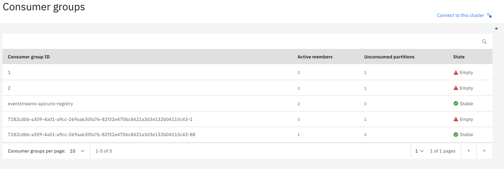
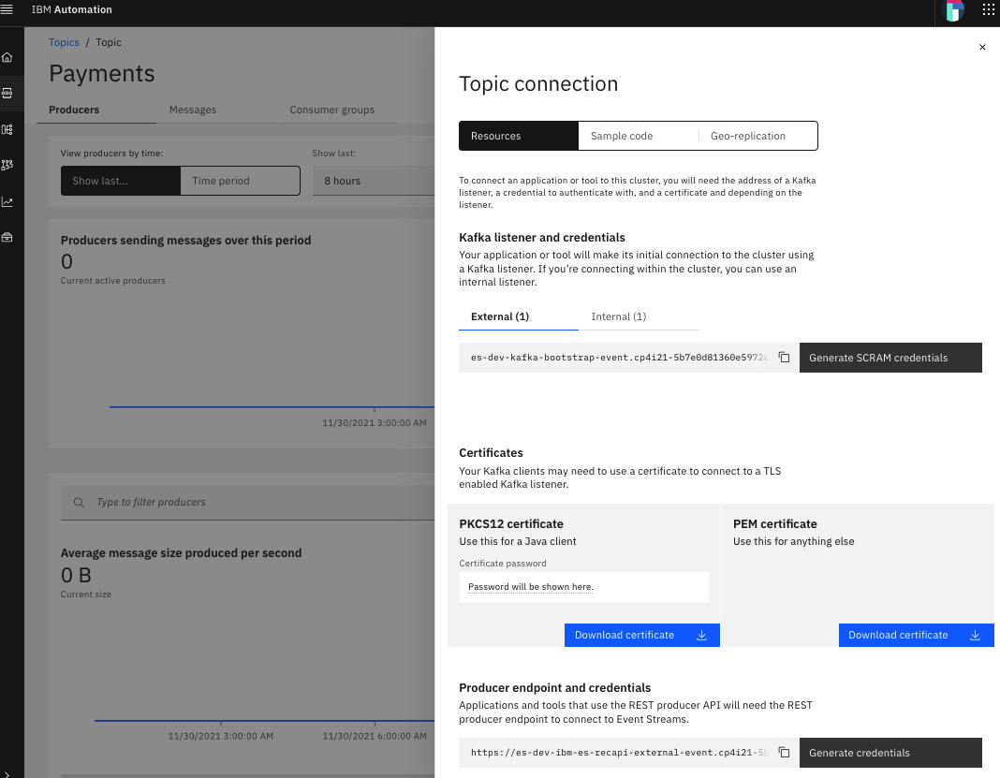

# Event Endpoint Management 

The new version of API Connect provides when it is installed with the Cloud Pak For Integration the ability to document, expose and socialize event endpoints that are available within your enterprise.

This feature allows to document an event endpoint (currently only Kafka Topic is supported) that is available in your enterprise using the [AsyncAPI specification](https://www.asyncapi.com).  
Once documented, the AsyncAPI can be published on the API Connect developer portal which allows the socialization of the event endpoint.

The last release introduces a great feature: it provides the ability to subscribe to the endpoint like you would do with an REST API endpoint and to control the access to the endpoint through a gateway (which is not currently DataPower) using the application credentials provided by the developer portal.    
The consumer application is accessing the gateway using Kafka protocol. 
When authentication and authorization is configured, only the consumer application that has been subscribed to the event through the developer portal will be allowed to only consume (publish is not allowed/supported) events from the Kafka Topic.   


More details can be found in the knowledge center at [socializing your Kafka event sources](https://www.ibm.com/docs/en/cloud-paks/cp-integration/2021.3?topic=socializing-your-kafka-event-sources).  

This article provides an high overview of the security available in the new event end point management solution and steps to configure [IBM EventStreams](https://ibm.github.io/event-streams/about/overview/) (the IBM eventing solution based on Kafka), creates the AysncAPI and consume the exposed event endpoint using Java.

# Configuration and setup

## Security principle

When the documented event endpoint is defined as "realized" (parameter in the AsyncAPI document), the event endpoint will be exposed on the event gateway and the security will be enforced.  

The security protocol between the consumer application and the gateway needs to be TLS with the SASL PLAIN authentication mechanism.   

The user and password is provided by the client id and secret associated to the application registered on the API Connect developer portal.  

The event gateway supports multiple type of security mechanism to connect with the Kafka cluster: PLAINTEXT, SCRAM or SSL.  

The group id provided by the gateway to consume the event is built using 
- a unique id generated when the AsyncAPI specification is created by the API Connect wizard (AsyncAPI-id)
- the application consumer client id (Client-id)
- the group id provided by the application consumer

```<AsyncAPI-id>-\<Client-id>-\<Group-id> ``` 


An example is provided here after:



Additional information can be found in the knowledge center at the [restricting access](https://www.ibm.com/docs/en/cloud-paks/cp-integration/2021.3?topic=sources-controlling-access-kafka-resources) section.

When authentication is configured to access the Kafka topic, it is possible to set specific ACL to further restrict what the consumer will be able to perform when consuming from the exposed event.
For example as the gateway is joining a group starting with "AsyncAPI-Id", one can set a read only option for any group starting with this id. 
You might also define that gateway user can only access specific topic using Kafka user template.

In ES the group read restriction can be set on the gateway kafka user CR using the following configuration:

```yaml
    acls:
      - host: '*'
        operation: Read
        resource:
          name: '<API_ID>'
          patternType: prefix
          type: group
```

## IBM EventStreams configuration

This provides information on how to configure Event Streams to allow an application to consume events from a Topic with SASL_SCRAM over SSL.

### Expose EventStreams Topic
EventStreams endpoint can be exposed externally or internally (from a Kubernetes cluster point of view). The proposed approach is to use an external acces.  

To configure EventStream with an external listener using SASL_SCRAM, the following parameters can be added in the EventStreams CR (Custom Resource):

```yaml
spec:
  strimziOverrides:
    kafka:
      listeners:
        external:
          authentication:
            type: scram-sha-512
          type: route
```
This configuration will tells the EventStreams operator to configure the security to use SCRAM_SHA512 and to create an OpenShift route with TLS passthrough.  
You will be able to access from your Kafka application the Kafka broker using the OpenShift route.

More information can be found in the EventStreams configuration page at the [Kafka access](https://ibm.github.io/event-streams/installing/configuring/) section.

### EventStreams credentials & connections

When SCRAM is enabled, the credentials can be generated from the EventStreams UI.
Select the Topic and choose in the UI "connect to this topic".


The UI provides the required information to access the topic:
- The bootstrap url
- The EventStreams server certificate

The credentials can be generated using the button "Generate SCRAM credentials".   
What is been generated behind the scene is a KafkaUser CR with a k8s Secret Object. 
The secret name has the same name as the KafkaUser and it is shown in the KafkaUser status (```oc  get KafkaUser appconnect -o yaml | yq e '.status' - ```).  

The KafkaUser defines the authentication method and the authorization using access control list:

```yaml
authentication:
  type: scram-sha-512
authorization:
  acls:
    - host: '*'
      operation: Read
      resource:
        name: '*'
        patternType: literal
        type: topic
    - host: '*'
      operation: Read
      resource:
        name: __schema_
        patternType: prefix
        type: topic
```  

The user is for example authorized to read all topic (patternType literal and name "*"). It is also allowed to access the EventStream schema registry (name "\__schema__" of type "topic").

The associated secret has the following content:

```yaml
apiVersion: v1
kind: Secret
metadata:
  name: <KafkaUser>
data:
  password: d0...v
  sasl.jaas.config: b3J...I7

```

The user and password to be used for accessing the topic will be the secret name (KafkaUser) and the password provided by the secret.

The communication between the consumer and the Kafka broker will be protected using TLS. 
The consumer will need to have the EventStream server certificate in it's TrustStore in oder to be able to connect. The certificate can be downloaded from the UI either as a PKCS12 TrustStore or as a PEM certificate (imported afterwards in a TrustStore).

The certificate is stored within a secret having a name following the template ```<eventStream-cluster-name>-cluster-ca-cert```

Additional information can be found at the following [EventStreams managing access](https://ibm.github.io/event-streams/security/managing-access/)

## AsyncAPI

When API Connect is installed with the CP4I, API Connect provides the ability to create AsyncAPI document.  
The AsyncAPI is used to configure and describe event that are made available by a  Kafka Topic.  
The topic can be exposed to consumer through an event gateway and the configuration is provided by the AsyncAPI document and the gateway is configured when the AsyncAPI document is published.  

All the information required to create the document is provided in the CP4I knowledge center at [editing the document](https://www.ibm.com/docs/en/cloud-paks/cp-integration/2021.3?topic=sources-editing-document).

The information allowing the gateway to connect to the Kafka cluster (with SASL_SCRAM) are:
- bootstrap server: this information is available on the UI
- Topic: the topic name to get the event from. The name is case sensitive.
- user: either on the ui or using the KafkaUser
- password: either on the ui or using the secret: ```oc get secret <kafkauser> -o json | jq '.data.password' ```
- the Kafka server certificate: ```oc get secret <es_instance>-cluster-ca-cert -o json | jq -r '.data."ca.crt"' | base64 -d```

An Avro schema can also be provided. It can then be downloaded from the developer portal.

When the AsyncAPI is created, API Connect add the **clusterconfigid** in the document which will be used to compute the groupid that the event gateway will use to connect to the Kafka broker.  

The gateway configuration is defined in the AsyncAPI document under x-ibm-configuration.assembly.execute.invoke-kafka (it can also be edited using the UI).

# Consuming the Event

Example of an AsyncAPI can be found here: [PaymentStatus.yaml](../assets/files/eem/PaymentStatus.yaml).  
Or on the [APIC developer portal](https://apic-ptl-portal-web-apic.cp4i21-5b7e0d81360e5972646d63308bd04bf7-0000.eu-de.containers.appdomain.cloud/innovative-org/sandbox/product/14/api/13) on my CP4I stack (if link doesn't work, search for the payment status product/api).

## Subscribe to the published event
Once the AsyncAPI is published (using an API Connect product), an application developer can login in the developer portal and subscribe to the product just as a REST API.

Some code example is provided in the developer portal with the information required to configure the consumer:
- event gateway url
- SCRAM mechanism
- user name
- user password (this is the application client key and need to be retrieved as usual)
- the event gateway certificate that will be required for the TLS connection
- the avro schema if it was provided in the AsyncAPI

Usually Java application consuming the Kafka event would require to have the gateway certificate uploaded in its TrustStore.  
For production environment we would expect that the gateway certificate would be trusted by a public CA allowing the consumer to trust the gateway certificate using the CA.  
For custom certificate the gateway certificate would need to be shared with the consumer. This can be done by either getting the certificate using openssl or sharing it in the API Connect developer portal through documentation.  

Getting the certificate using openssl:
```shell
echo -n | openssl s_client -connect $GWHOST:443 -servername $GWHOST -showcerts | openssl x509 > event-gateway.crt
```

The Event Endpoint Manager administrator can retrieve the gateway certificate using the API Connect cli.

```shell
./apiccli login --server $apicmgmt --username $1 --realm admin/<LUR_Name>
./apiccli keystores:list -s $apicmgmt -o admin | grep gateway-services
./apiccli keystores:get -s $apicmgmt -o admin --format json tls-server-for-gateway-services-default-keystore --output -  | jq -r .public_certificate_entry.pem
```

If you encounter issue with the import of the certificate please have a look to 
[Client receives ‘Failed to load SSL keystore’ message when communicating with brokers - IBM Event Streams](https://ibm.github.io/event-streams/troubleshooting/pkcs12-keystore-java-client/).

## Configure the Java Consumer application

This section provides some information on how to configure a Java consumer to consume Kafka Event.

When an Event endpoint is exposed on the event gateway, the developer portal provides code sample that can be used to consume events through the gateway.  

An example of code that can be used for the connection is given here:

```java
props.put("security.protocol","SASL_SSL");
props.put("sasl.mechanism","PLAIN");
props.put("sasl.jaas.config","org.apache.kafka.common.security.scram.ScramLoginModule required username=\"appClientId\" password=\"appClientSecret\";");
props.put(SslConfigs.SSL_TRUSTSTORE_TYPE_CONFIG, "JKS");
props.put(SslConfigs.SSL_TRUSTSTORE_LOCATION_CONFIG, "truststore.jks");
props.put(SslConfigs.SSL_TRUSTSTORE_PASSWORD_CONFIG, "truststore-pwd");
```

The Java code requires to have the gateway certificate uploaded in the java trust store shown here above.  

The gateway certificate can be found either using the openssl command (see previous section) or by getting it from the developer portal if it was documented.

The following code shows how to create and add the certificate into the JKS trust store:

```shell
# create keustore and remove default key
keytool -genkey -keyalg RSA -alias endeca -keystore truststore.jks
keytool -delete -alias endeca -keystore truststore.jks
# add the downloaded gateway certificate into the jks
keytool -import -v -trustcacerts -alias myAlias -file myCert.pem -keystore truststore.jks
```

The code provided in the developer portal will give an example of Deserializer and Serializer. Their types will depend on the one specified in the AsyncAPI under the field "message.contentType" of the event payload. 
When contentType is "application/json" the proposed decoder will JSON based and when it is "application/octet" the decoder will be binary.


Jars can be found here
Kafka-clients:
https://mvnrepository.com/artifact/org.apache.kafka/kafka-clients

Avro:
https://mvnrepository.com/artifact/org.apache.avro/avro

# Resources

Great articles from Dale Lane: 
[Describing Kafka with AsyncAPI](https://dalelane.co.uk/blog/?p=4219)  
[Event Enpoint Management](https://dalelane.co.uk/blog/?p=4380)

