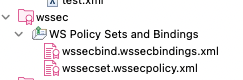
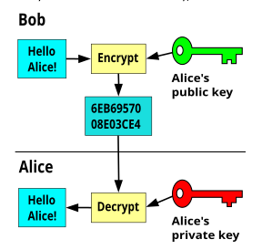
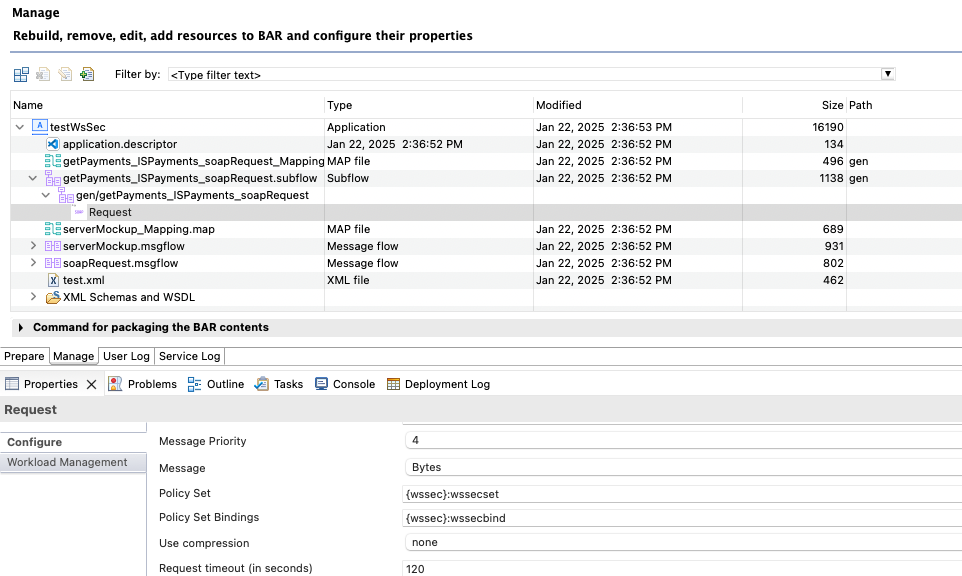

# Introduction
This post provides a very short summary on how to configure and deploy an ACE flow that is using WSSEC. 

The example provided here is a simple flow that uses a SOAP Request node configured with a WSSEC policy to encrypt the SOAP Body.  

# Configuration

### ACE runtime

The WS-Sec framework used by ACE still requires Java8.   
You will need to specify that the integration server has to run under the JRE 8.  

```shell
ibmint specify jre --version 8 --work-directory <work-dir>
ibmint display supported-jre-versions
```


### PKI Infrastructure

A keystore and a truststore needs to be configured.

```yaml
ResourceManagers:
  HTTPConnector:
    ListenerPort: 7800
  JVM:
    jvmDebugPort: 9997
    keystoreType: 'JKS'                # JVM key store type, can be 'JKS' or 'PKCS12'.
    keystoreFile: '/Users/prichelle/Documents/workspace/ace/toolkit/toolkit_gc/TEST_SERVER/ks_aceis.jks'                # JVM location of the key store
    keystorePass: 'keystorePass'                # JVM resource alias containing the key store password
    truststoreType: 'JKS'               # JVM trust store type, can be 'JKS' or 'PKCS12'.
    truststoreFile: '/Users/prichelle/Documents/workspace/ace/toolkit/toolkit_gc/TEST_SERVER/ks_aceis.jks'              # JVM location of the trust store
    truststorePass: 'truststorePass'              # JVM resource alias containing the trust store password
```

Credentials to the keystore/truststore can be defined using for example a VAULT.

```shell
mqsicredentials --ext-vault-dir $vkpath --ext-vault-key Passw0rd --create --credential-type truststore --credential-name keystorePass --password passw0rd
mqsicredentials --ext-vault-dir $vkpath --ext-vault-key Passw0rd --create --credential-type keystore --credential-name truststorePass --password passw0rd
```

### Create the policySet & Bindings

This will create a policy project with the two policy sets.


#### SOAP Body encryption

The following configuration is provided to encrypt the soap body.  
The solution provides also the possibility to encrypt only a specific field using QName or XPATH.   

The flow provided is using a **SOAPRequest** node.  
The payload is encrypted using an asymmetric cryptography with X.509 **public** key provided by the service to be called. The service will decrypt the payload using its **private** key.    



The public key is hold in a certificate that needs to be made available in the ACE truststore.  

Sets:

```xml
<?xml version="1.0" encoding="UTF-8"?>
<policy:Policy xmlns:_0="http://docs.oasis-open.org/wss/2004/01/oasis-200401-wss-wssecurity-utility-1.0.xsd" xmlns:_200512="http://docs.oasis-open.org/ws-sx/ws-securitypolicy/200512" xmlns:policy="http://schemas.xmlsoap.org/ws/2004/09/policy">
  <_200512:AsymmetricBinding>
    <policy:Policy>
      <_200512:RecipientToken>
        <policy:Policy>
          <_200512:X509Token _200512:IncludeToken="http://docs.oasis-open.org/ws-sx/ws-securitypolicy/200512/IncludeToken/AlwaysToRecipient">
            <policy:Policy Name="dpgw">
              <_200512:WssX509V3Token10/>
            </policy:Policy>
          </_200512:X509Token>
        </policy:Policy>
      </_200512:RecipientToken>
      <_200512:AlgorithmSuite>
        <policy:Policy>
          <_200512:Basic256/>
        </policy:Policy>
      </_200512:AlgorithmSuite>
      <_200512:Layout>
        <policy:Policy>
          <_200512:Strict/>
        </policy:Policy>
      </_200512:Layout>
    </policy:Policy>
  </_200512:AsymmetricBinding>
  <policy:Policy _0:Id="request:encbody">
    <_200512:EncryptedParts>
      <_200512:Body/>
    </_200512:EncryptedParts>
  </policy:Policy>
</policy:Policy>
```

`<_200512:RecipientToken>`
Specifies the security token that the recipient must use. The recipient is expected to decrypt the message using the corresponding private key.
`<_200512:X509Token>`
Indicates that the X.509 certificate is used for token-based authentication and encryption.
- `_200512:IncludeToken="AlwaysToRecipient"` Ensures that the token (certificate) is always included in the message sent to the recipient.
- `<_200512:WssX509V3Token10>`Specifies compliance with the X.509 v3 token profile defined by WS-Security.

`<policy:Policy _0:Id="request:encbody">`
Defines a policy for encrypting specific parts of the SOAP message.
- `<_200512:EncryptedParts>`
Specifies which parts of the message should be encrypted.
    - `<_200512:Body>` Indicates that the entire SOAP body must be encrypted.

Binding:

The binding will provide information on how to get the certificate from the infrastructure:

```xml
<securitybinding:securityBindings xmlns:securitybinding="http://www.ibm.com/xmlns/prod/websphere/200710/ws-securitybinding">
  <securitybinding:securityBinding name="application">
    <securitybinding:securityOutboundBindingConfig>
      <securitybinding:encryptionInfo name="gen_encbody" order="1">
        <securitybinding:keyEncryptionKeyInfo reference="gen_dpgw_encencbody_keyinfo"/>
        <securitybinding:encryptionPartReference reference="request:encbody"/>
      </securitybinding:encryptionInfo>
      <securitybinding:keyInfo classname="com.ibm.ws.wssecurity.wssapi.CommonContentGenerator" name="gen_dpgw_encencbody_keyinfo" type="KEYID">
        <securitybinding:tokenReference reference="gen_requestencbody"/>
      </securitybinding:keyInfo>
      <securitybinding:tokenGenerator classname="com.ibm.ws.wssecurity.wssapi.token.impl.CommonTokenGenerator" name="gen_requestencbody">
        <securitybinding:valueType localName="http://docs.oasis-open.org/wss/2004/01/oasis-200401-wss-x509-token-profile-1.0#X509v3"/>
        <securitybinding:jAASConfig configName="system.wss.generate.x509"/>
        <securitybinding:callbackHandler classname="com.ibm.websphere.wssecurity.callbackhandler.X509GenerateCallbackHandler">
          <securitybinding:keyStore path="*MQSIBROKERSTOREPATHMQSI*" storepass="*MQSIBROKERSTOREPWDMQSI*" type="JKS"/>
          <securitybinding:key alias="dpgw" name="CN=pair"/>
        </securitybinding:callbackHandler>
      </securitybinding:tokenGenerator>
    </securitybinding:securityOutboundBindingConfig>
    <securitybinding:securityInboundBindingConfig/>
  </securitybinding:securityBinding>
</securitybinding:securityBindings>
```

The key used for encryption is identified using `gen_dpgw_encencbody_keyinfo`.
The key should be defifined in the soap header using a unique key identifier (KEYID).   
The key is from a x509 certificate identified by an alias (here dpgw) and distinguished name (here CN=pair) that is stored in the integration server store.  

Example of XML generated:

```xml
<?xml version="1.0" encoding="utf-8"?>
<soapenv:Envelope xmlns:soapenv="http://schemas.xmlsoap.org/soap/envelope/">
    <soapenv:Header>
        <wsse:Security
            xmlns:wsse="http://docs.oasis-open.org/wss/2004/01/oasis-200401-wss-wssecurity-secext-1.0.xsd"
            soapenv:mustUnderstand="1">
            <enc:EncryptedKey xmlns:enc="http://www.w3.org/2001/04/xmlenc#">
                <enc:EncryptionMethod Algorithm="http://www.w3.org/2001/04/xmlenc#rsa-oaep-mgf1p">
                    <ds:DigestMethod xmlns:ds="http://www.w3.org/2000/09/xmldsig#"
                        Algorithm="http://www.w3.org/2000/09/xmldsig#sha1"></ds:DigestMethod>
                </enc:EncryptionMethod>
                <ds:KeyInfo xmlns:ds="http://www.w3.org/2000/09/xmldsig#">
                    <wsse:SecurityTokenReference>
                        <wsse:KeyIdentifier
                            EncodingType="http://docs.oasis-open.org/wss/2004/01/oasis-200401-wss-soap-message-security-1.0#Base64Binary"
                            ValueType="http://docs.oasis-open.org/wss/2004/01/oasis-200401-wss-x509-token-profile-1.0#X509SubjectKeyIdentifier">
                            OVTXbnf1ypVOGUP+fbizdd5MyXo=</wsse:KeyIdentifier>
                    </wsse:SecurityTokenReference>
                </ds:KeyInfo>
                <enc:CipherData>
                    <enc:CipherValue>
                        TdV7bUx0tN3vMMSeRnVTS0VcWaA==</enc:CipherValue>
                </enc:CipherData>
                <enc:ReferenceList>
                    <enc:DataReference URI="#wssecurity_encryption_id_20"></enc:DataReference>
                </enc:ReferenceList>
            </enc:EncryptedKey>
        </wsse:Security>
    </soapenv:Header>
    <soapenv:Body>
        <enc:EncryptedData xmlns:enc="http://www.w3.org/2001/04/xmlenc#"
            Id="wssecurity_encryption_id_20" Type="http://www.w3.org/2001/04/xmlenc#Content">
            <enc:EncryptionMethod Algorithm="http://www.w3.org/2001/04/xmlenc#aes256-cbc"></enc:EncryptionMethod>
            <enc:CipherData>
                <enc:CipherValue>
                    R1juvdmoaEpYeRZqDwcERBQx/zlQSB1n8rd4tO8nh13qgQD0yRIDzQHxxLOCLQ+fj3yjm+xr2XfK+dJpWN8lpuTu2JyALTS9u6PnxdY8GQ==</enc:CipherValue>
            </enc:CipherData>
        </enc:EncryptedData>
    </soapenv:Body>
</soapenv:Envelope>
```

# Deploy the Integration Applications

The deployment of an integration application using wssec follows the steps:  

- Deploy the WSSEC policy project   
- Build the bar file  
- Edit the SOAP request properties in the bar file  
Reference the policy set on the SOAP Request node by editing the bar file.   
The policy are referenced with `{myPolicyProject}:policyset/binding` where policyset is for example "wssecset" when the policy file name is "wssecset.wssecpolicy.xml" and binding is for "wssecbind" if the policy binding file name is "wssecbind.wssecbindings.xml":  


- Deploy the flows using the bar file.  

## Example
A very simple example is provided as a project interchange.

[simple WSSec PI](../assets/files/ace/simpleWSSec_PI.zip)

The project interchange contains
- an application exposed as simple HTTP that is using a SOAP Request configured using a wsdl. The soap request node is calling another ACE HTTP flow.
- another ACE application is configured with an HTTP Iinput that trace the request and send back a soap message using a mapping node.  
- The message generated by the SOAP Request node can be seen in the trace. 

The first flow can be called using 
```shell
curl localhost:7800/callWS
```